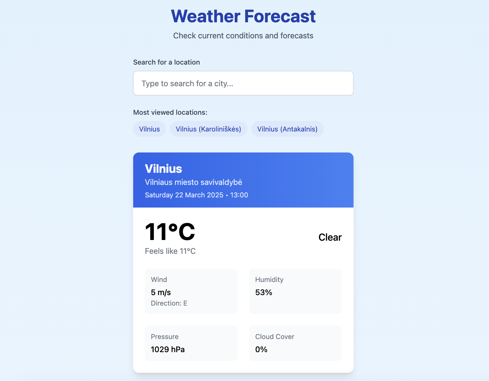
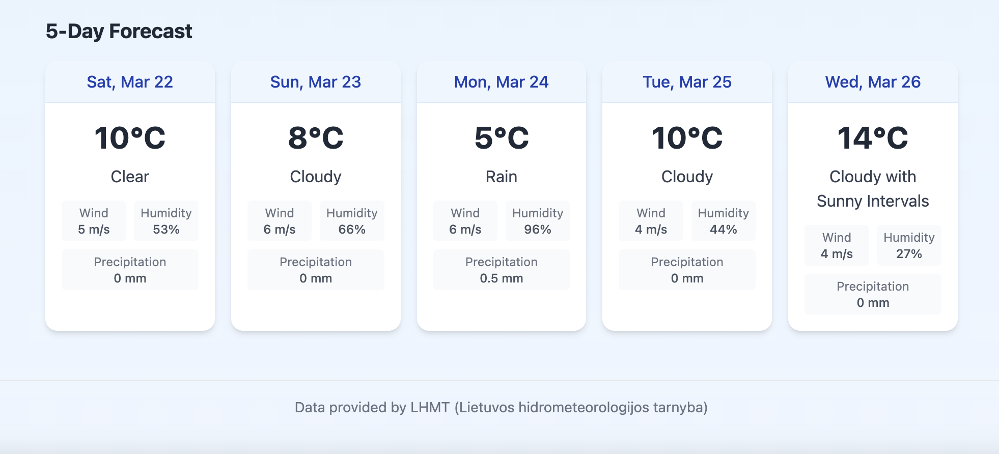
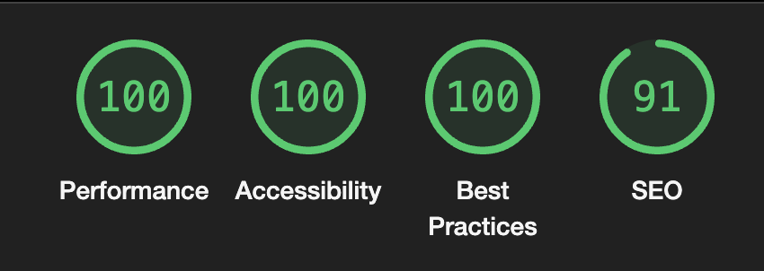

# Weather Forecast App

<p align="center">
  Weather forecasts with alert rules, digest scheduling, and SMTP-powered email notifications.
</p>

<p align="center">
  
  
  
  
  
</p>

This project combines a React frontend and a .NET backend to deliver weather forecasts, usage analytics, and configurable email alerts and digests for authenticated users.




## Features

- Responsive layout for all device sizes
- Searchable dropdown to select cities for weather forecasts
- Per-user history with server-side logging (no reliance on localStorage for auth’d users)
- Weather analytics endpoints: hottest/coldest cities, top cities, recent views
- Alert rules with quiet hours, per-rule digest inclusion, daily digest scheduling, and manual “send digest now”
- Email notifications for alerts/digests (SMTP-configurable) with throttling to avoid provider rate limits
- Display of current weather conditions and 5-day forecasts (implementation shown below)
- JWT-based authentication with optional guest mode for quick previews


_5-day forecast_

## Tech Stack

### Frontend

- React 18 with Vite
- Axios for API requests
- Tailwind CSS (as a PostCSS plugin) for utility-based styling

### Backend

- .NET 9 Web API
- Entity Framework Core + SQLite for persistence
- JWT authentication with DotNetEnv-driven configuration
- Background worker for alert evaluation + digest processing
- SMTP email delivery for alerts/digests (pluggable via env variables)

### APIs

- api.meteo.lt for weather data

## Setup Instructions

### Prerequisites

- Node.js (v16+) for the React client
- npm or yarn
- .NET SDK 9.x for the API

### Installation

1. Clone the repository

```bash
git clone https://github.com/nojusta/weather-forecast-app
cd weather-forecast-app
```

2. Install dependencies

```bash
# Frontend
cd client
npm install

# Backend (restores NuGet packages)
cd ../server
dotnet restore
```

3. Create `.env` files:

- **Server (`server/.env`)** – JWT + database + optional SMTP configuration:

  ```ini
  JWT_SECRET_KEY=<Generate_jwt_token_and_add_here>
  CONNECTION_STRING=Data Source=weather-app.db

  # SMTP (required for alert emails/digests)
  SMTP_HOST=<smtp_host>
  SMTP_PORT=587
  SMTP_USER=<smtp_username>
  SMTP_PASS=<smtp_password>
  SMTP_FROM=noreply@weatheralerts.local
  ```

- **Client directory (`client/.env`)** – frontend API target:
  ```ini
  VITE_API_URL=http://localhost:5053
  ```

⚠️ **These `.env` files are not included in the repository for security practices** but are required for the application to function properly. Make sure to create both files before starting the development servers.

4. Apply migrations and start the development servers

```bash
# Backend
cd server
dotnet ef database update
dotnet run

# Frontend (in a new terminal)
cd client
npm run dev
```

5. Open `http://localhost:5173` in your browser. (Port may vary depending on your system).

💡 _To create a production build, use `npm run build`, and preview it with `npm run preview`._

## Project Structure

```
weather-forecast-app/
├── client/                      # Frontend
│   ├── public/                  # Static assets
│   ├── src/
│   │   ├── components/          # React components
│   │   ├── services/            # API calls and logging
│   │   ├── test/                # Test configurations
│   │   ├── App.jsx              # Main App component
│   │   ├── main.jsx             # Entry point
│   │   ├── index.css            # Global styles
│   ├── tailwind.config.js       # Tailwind config
│   ├── vite.config.js           # Vite config
├── server/                      # .NET 9 Web API backend
│   ├── appsettings*.json        # Environment configs
│   ├── Controllers/             # Auth, weather, logging endpoints
│   ├── Data/                    # EF Core DbContext + factories
│   ├── Migrations/              # Database schema history
│   ├── Models/                  # Request/response + entity models
│   ├── Services/                # Auth, CityLog, Alerts (worker, email, throttle, time helpers)
│   ├── Program.cs               # Entry point / middleware
│   ├── server.csproj            # Project definition
│   ├── bin/Debug/net9.0/        # Build output (trimmed)
│   └── obj/                     # Build artifacts
└── README.md                    # Documentation
```

## Testing and Quality Assurance

### Testing Stack

- **Vitest** (test runner)
- **React Testing Library** (component testing)
- **Jest DOM** (DOM matchers)
- **Axios & LocalStorage mocking** for isolated tests

### Component Tests

Tests that verify UI components render and behave correctly:

- **Layout Component**

  - Renders header with application title
  - Includes navigation structure
  - Correctly renders child components

- **CitySearch Component**

  - Filters cities based on user input
  - Displays loading state appropriately
  - Shows most viewed cities section
  - Handles empty search and selection events

- **CurrentWeather Component**

  - Displays location name and region
  - Shows temperature and "feels like" values
  - Renders weather conditions and metadata
  - Gracefully handles missing data

- **ForecastDisplay Component**
  - Renders exactly 5 days of forecast data
  - Groups forecasts correctly by day
  - Shows temperature and conditions for each day
  - Returns null when data is missing

### Service Tests

Tests that verify API communication and data handling:

- **Weather Service**

  - Handles API errors with proper error propagation
  - Manages empty or malformed API responses

- **Log Service**
  - Successfully logs city view events
  - Handles network failures without crashing

### Integration Tests

- **App Component**
  - Loads and stores most viewed cities in localStorage
  - Updates localStorage when a city is selected
  - Maintains a maximum of 3 most viewed cities

### Running Tests

```bash
# Run all tests
npm test

# Run tests with coverage
npm test -- --coverage

# Watch mode
npm run test:watch
```

## Performance Optimization

A Lighthouse audit of the deployed application shows excellent performance metrics.


_Lighthouse audit results_

### Performance Metrics

| Metric                   | Score   | Description             |
| ------------------------ | ------- | ----------------------- |
| Performance              | 100/100 | Optimized performance   |
| First Contentful Paint   | 0.4s    | Initial content load    |
| Largest Contentful Paint | 0.4s    | Main content load       |
| Total Blocking Time      | 0ms     | Minimal thread blocking |
| Cumulative Layout Shift  | 0       | Stable layout           |
| Speed Index              | 0.4s    | Fast content display    |
